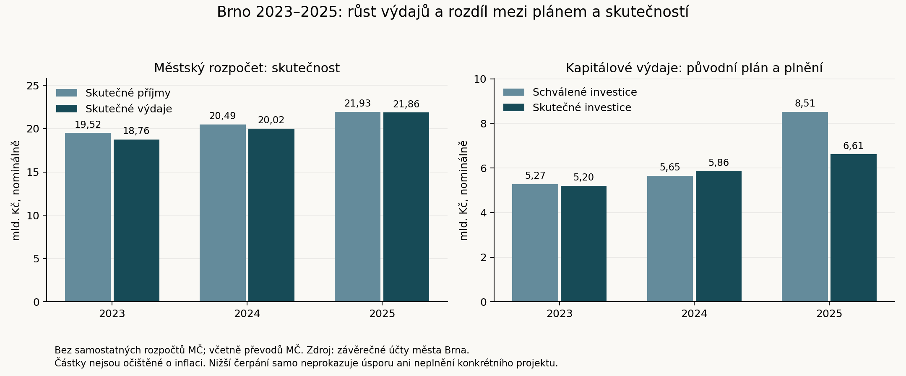

# Brno před komunálními volbami 2026: bilance celoměstské samosprávy

**Uzávěrka: 18. září 2026. Rozsah: Zastupitelstvo města Brna a vedení statutárního města, nikoli zastupitelstva 29 městských částí.** Volby jsou vyhlášeny na 9. a 10. října 2026. [pramen — archiv](https://csu.gov.cz/volby-2026); [web](https://csu.gov.cz/volby-2026)

Tento přehled spojuje personální evidenci, skutečná hlasování, rozpočtová data, výsledky významných projektů a kontrolní zjištění. Doprovází jej archiv originálů a strojově zpracovatelná data. Úplná je evidence dnešních zastupitelů a doložených výměn mandátů v období; tematické posouzení je výběrové a není úplným auditem každého úkonu každé osoby. Rozsah stažených pramenů a mezery jsou uvedeny v metodice. [Rozcestník archivu](../index.html), [tematická bilance](temata.md), [významná hlasování](hlasovani.md), [metodika](metodika.md).

## Co se v období podstatně změnilo

Město vstoupilo do období s mimořádně širokou koalicí o 42 z 55 mandátů. V jejím čele zůstala Markéta Vaňková. Personální jádro vedení vydrželo, ale do roku 2026 se zásadně změnily stranické a klubové vazby: většina původního klubu ANO nyní působí v uskupení Brnoklidem a nezávislí zastupitelé. Dnešní vedení tedy nelze popsat pouze názvy kandidátek z voleb 2022. [pramen — archiv](https://www.brno.cz/documents/20121/300693/2022-2026-Koalicni-smlouva.pdf/e557ed70-7468-2fe8-0260-a0aaefed0861); [web](https://www.brno.cz/documents/20121/300693/2022-2026-Koalicni-smlouva.pdf/e557ed70-7468-2fe8-0260-a0aaefed0861) [pramen — archiv](https://www.brno.cz/documents/20121/13851179/Z9-32-Z+U_P1.pdf/7ba79d55-7753-8632-95bf-58aa5f979a2e); [web](https://www.brno.cz/documents/20121/13851179/Z9-32-Z+U_P1.pdf/7ba79d55-7753-8632-95bf-58aa5f979a2e) [pramen — archiv](https://www.brno.cz/documents/20121/14724735/Zápis Z9_34-Z+U_P1.pdf/65894a13-c5dd-8cd2-07bf-01dcca5a46d1); [web](https://www.brno.cz/documents/20121/14724735/Zápis Z9_34-Z+U_P1.pdf/65894a13-c5dd-8cd2-07bf-01dcca5a46d1)

Nejvýraznější regulatorní výsledek představuje nový územní plán a vlastní brněnské stavební předpisy. Investiční bilance je smíšená: část převzatých i nově realizovaných staveb byla otevřena, zatímco největší projekty zůstávají rozestavěné nebo v přípravě. U Kamech či kolektoru Česká lze doložit zahájení slíbené stavby; u T ARENY, Janáčkova kulturního centra, družstevních bytů na Kamenném vrchu či Červeného kopce nelze k uzávěrce vykazovat plně fungující dokončené zařízení. Podrobné doklady obsahuje [bilance 26 témat](temata.md).

Hospodaření ukazuje rostoucí nominální výdaje i investice, ale také rozdíl mezi plánem a skutečným čerpáním. V roce 2025 se na městské úrovni uskutečnily kapitálové výdaje 6,612 mld. Kč proti původně schváleným 8,514 mld. Kč. Účetní výhrada se týkala především opakovaného pozdního zařazování majetku do užívání. Nelze ji vydávat ani za důkaz trestné činnosti, ani ji vynechat při tvrzení o bezproblémovém hospodaření. [pramen — archiv](https://www.brno.cz/documents/20121/14861969/Zaverecny-ucet-SMB-2025_P.pdf/7eeee15f-9a71-d00c-2b7c-b8b5103df2b0); [web](https://www.brno.cz/documents/20121/14861969/Zaverecny-ucet-SMB-2025_P.pdf/7eeee15f-9a71-d00c-2b7c-b8b5103df2b0)

## Kdo získal mandát a kdo nyní rozhoduje

Základním obdobím jsou volby 23.–24. září 2022 a navazující mandáty do uzávěrky. Není nutné katalogizovat několik starších zastupitelstev: všech 55 nynějších mandátů vychází z těchto voleb nebo náhradnictví na tehdejších kandidátkách. Starší události jsou připomenuty tam, kde jsou nutné pro pochopení převzatých projektů.

### Volební výsledek 2022

| Kandidátka | Podíl ČSÚ bez zaokrouhlení (%) | Mandáty |
| --- | --- | --- |
| SPOLEČNĚ - ODS a TOP 09 | 25,02 | 16 |
| ANO 2011 | 20,46 | 13 |
| Lidovci a Starostové (KDU-ČSL + Starostové a nezávislí) | 17,10 | 10 |
| SPD, TRIKOLORA, MORAVANÉ a nezávislí | 9,78 | 6 |
| Česká pirátská strana | 7,07 | 4 |
| ČSSD VAŠI STAROSTOVÉ | 6,10 | 3 |
| Zelení a Žít Brno s podporou Idealistů | 5,96 | 3 |

Podíly jsou převzaty přesně z pole PROCHLSTR otevřeného registru ČSÚ, které [původní schéma](../data/csu_schema_kvros.json) definuje jako přepočtené procento **bez zaokrouhlení**. Proto například 25,02 v registru odpovídá běžně zaokrouhlenému podílu 25,03 %. V komunálních volbách může volič rozdělit více hlasů, takže součet hlasů kandidátky ani osobní hlasy kandidáta nejsou počtem jejích výhradních voličů. Archiv obsahuje všech 668 kandidátních záznamů pro celoměstské zastupitelstvo, všech 14 kandidátek a samostatný výběr osob, které mandát skutečně získaly nebo později převzaly. [pramen — archiv](https://www.volby.cz/opendata/kv2022/KV2022reg20260328_csv.zip); [web](https://www.volby.cz/opendata/kv2022/KV2022reg20260328_csv.zip)

Původní koaliční smlouvu uzavřely SPOLEČNĚ – ODS a TOP 09, ANO, Lidovci a Starostové a ČSSD VAŠI STAROSTOVÉ. Piráti se před podpisem z připravované koalice stáhli. Vznikla většina 16 + 13 + 10 + 3 = 42 mandátů; zbývajících 13 připadlo opozičním kandidátkám. Ustavující zastupitelstvo zvolilo vedení 20. října 2022. [pramen — archiv](https://www.brno.cz/documents/20121/300693/2022-2026-Koalicni-smlouva.pdf/e557ed70-7468-2fe8-0260-a0aaefed0861); [web](https://www.brno.cz/documents/20121/300693/2022-2026-Koalicni-smlouva.pdf/e557ed70-7468-2fe8-0260-a0aaefed0861) [pramen — archiv](https://www.brno.cz/documents/20121/3343732/Z9-01-ustavujici-Z+U_P.pdf/f2054fe8-1868-2a93-74f9-0e8589be16aa); [web](https://www.brno.cz/documents/20121/3343732/Z9-01-ustavujici-Z+U_P.pdf/f2054fe8-1868-2a93-74f9-0e8589be16aa) [pramen — archiv](https://ct24.ceskatelevize.cz/clanek/regiony/v-brne-vznikla-radnicni-koalice-pirati-ji-kvuli-bytove-kauze-opustili-kratce-pred-podpisem-smlouvy-15122); [web](https://ct24.ceskatelevize.cz/clanek/regiony/v-brne-vznikla-radnicni-koalice-pirati-ji-kvuli-bytove-kauze-opustili-kratce-pred-podpisem-smlouvy-15122)

### Výměny osob

| Odcházející | Nástupce | Nástup náhradníka | Pramen |
| --- | --- | --- | --- |
| Petra Quittová | Jaroslav Suchý | 2022-10-20 | [zápis — archiv](https://www.brno.cz/documents/20121/3343732/Z9-01-ustavujici-Z+U_P.pdf/f2054fe8-1868-2a93-74f9-0e8589be16aa); [web](https://www.brno.cz/documents/20121/3343732/Z9-01-ustavujici-Z+U_P.pdf/f2054fe8-1868-2a93-74f9-0e8589be16aa) |
| Jitka Ivičičová | Petr Bořecký (Lidovci a Starostové) | 2024-01-25 | [zápis — archiv](https://www.brno.cz/documents/20121/9374549/Z9-14-Z+U_P1.pdf/70f077d3-dc4d-85c2-aa4a-7a4d2ff15eb9); [web](https://www.brno.cz/documents/20121/9374549/Z9-14-Z+U_P1.pdf/70f077d3-dc4d-85c2-aa4a-7a4d2ff15eb9) |
| Petr Bauer | Tomáš Hejl | 2024-09-05 | [zápis — archiv](https://www.brno.cz/documents/20121/11104225/Z9-19-Z+U_P2.pdf/e761437c-4849-c81a-05e6-724b385ae357); [web](https://www.brno.cz/documents/20121/11104225/Z9-19-Z+U_P2.pdf/e761437c-4849-c81a-05e6-724b385ae357) |
| Tomáš Hejl | Sabina Benešová | 2025-05-27 | [zápis — archiv](https://www.brno.cz/documents/20121/12494418/Z9-27-Z+U_P3.pdf/0a8d7be5-073b-a363-82e4-0abefb0b3db5); [web](https://www.brno.cz/documents/20121/12494418/Z9-27-Z+U_P3.pdf/0a8d7be5-073b-a363-82e4-0abefb0b3db5) |
| Matěj Hollan | Matouš Vencálek | 2026-01-07 | [zápis — archiv](https://www.brno.cz/documents/20121/13851179/Z9-32-Z+U_P1.pdf/7ba79d55-7753-8632-95bf-58aa5f979a2e); [web](https://www.brno.cz/documents/20121/13851179/Z9-32-Z+U_P1.pdf/7ba79d55-7753-8632-95bf-58aa5f979a2e) |
| Kristýna Černá | Pavel Jankůj | 2026-04-01 | [zápis — archiv](https://www.brno.cz/documents/20121/14724735/Zápis Z9_34-Z+U_P1.pdf/65894a13-c5dd-8cd2-07bf-01dcca5a46d1); [web](https://www.brno.cz/documents/20121/14724735/Zápis Z9_34-Z+U_P1.pdf/65894a13-c5dd-8cd2-07bf-01dcca5a46d1) |

Přehled zahrnuje **61 různých držitelů mandátu**, z nichž 55 je v aktuálním seznamu a šest mandát ukončilo. Petra Quittová odešla ještě před ustavujícím jednáním, proto ji nelze hodnotit podle pozdější hlasovací účasti. Tomáš Hejl mezitím mandát převzal i ukončil, proto by prosté porovnání volebních výsledků s dnešním seznamem jeho působení přehlédlo.

Petr Bořecký z listiny Lidovců a Starostů je jiná osoba než Ing. arch. Petr Bořecký z listiny ANO. Karin Podivinská Karasová kandidovala jako Karin Karasová a v části protokolů figuruje jako Karin Podivinská. Tyto odlišnosti jsou ve společné evidenci vyřešeny stabilními identifikátory. [Evidence osob](../data/osoby.csv).

### Současné kluby

| Klub na webu města | Počet |
| --- | --- |
| SPOLEČNĚ - ODS a TOP 09 | 16 |
| Brnoklidem a nezávislí zastupitelé | 11 |
| Lidovci a Starostové | 10 |
| SPD, TRIKOLORA, MORAVANÉ a NK | 5 |
| Klub neuveden | 4 |
| Česká pirátská strana | 3 |
| Zelení a Žít Brno s podpor. Id | 3 |
| ANO 2011 | 3 |

Tabulka zachycuje označení na oficiálním webu k uzávěrce. Prázdné pole není důkazem bezpartijnosti. Klub, stranická legitimace, původní volební listina a budoucí kandidatura jsou čtyři odlišné věci. U Tomáše Koláčného, Jiřího Olivy, Břetislava Štefana a Marka Viskota web klub neuvádí. Změnu klubů lze sledovat také po jednotlivých hlasováních v datovém souboru; ten ukazuje označení platné v daném protokolu.

V prosinci 2025 ANO vyloučilo deset brněnských zastupitelů, kteří odmítli opustit koalici. Zápis Z9/32 zaznamenává lednový vznik jedenáctičlenného klubu nezávislých; do skupiny patří také Petr Levíček, původně zvolený za SPD, TRIKOLORU, MORAVANY a nezávislé. Dubnový zápis zachycuje vznik klubu Brnoklidem a nezávislí zastupitelé. V původním označení ANO zůstávají Miroslav Kubásek, René Novotný a Pavel Outrata. Tyto změny neznamenají nové komunální volby ani automatickou ztrátu zastupitelského mandátu. [pramen — archiv](https://tn.nova.cz/zpravodajstvi/clanek/636063-ano-vyloucilo-vzpurne-cleny-z-brna-odmitli-opustit-koalici-s-ods); [web](https://tn.nova.cz/zpravodajstvi/clanek/636063-ano-vyloucilo-vzpurne-cleny-z-brna-odmitli-opustit-koalici-s-ods) [pramen — archiv](https://www.brno.cz/documents/20121/13851179/Z9-32-Z+U_P1.pdf/7ba79d55-7753-8632-95bf-58aa5f979a2e); [web](https://www.brno.cz/documents/20121/13851179/Z9-32-Z+U_P1.pdf/7ba79d55-7753-8632-95bf-58aa5f979a2e) [pramen — archiv](https://www.brno.cz/documents/20121/14724735/Zápis Z9_34-Z+U_P1.pdf/65894a13-c5dd-8cd2-07bf-01dcca5a46d1); [web](https://www.brno.cz/documents/20121/14724735/Zápis Z9_34-Z+U_P1.pdf/65894a13-c5dd-8cd2-07bf-01dcca5a46d1)

### Vedení města a odpovědnost

| Člen/ka rady | Funkce dle města | Doklad |
| --- | --- | --- |
| [Markéta Vaňková](../profily/marketa-vankova.md) | Primátorka města Brna | [profil — archiv](https://www.brno.cz/w/marketa-vankova); [web](https://www.brno.cz/w/marketa-vankova) |
| [René Černý](../profily/rene-cerny.md) | I. náměstek primátorky | [profil — archiv](https://www.brno.cz/w/rene-cerny); [web](https://www.brno.cz/w/rene-cerny) |
| [Filip Chvátal](../profily/filip-chvatal.md) | náměstek primátorky | [profil — archiv](https://www.brno.cz/w/filip-chvatal); [web](https://www.brno.cz/w/filip-chvatal) |
| [Robert Kerndl](../profily/robert-kerndl.md) | náměstek primátorky | [profil — archiv](https://www.brno.cz/w/robert-kerndl); [web](https://www.brno.cz/w/robert-kerndl) |
| [Karin Podivinská Karasová](../profily/karin-podivinska-karasova.md) | náměstkyně primátorky | [profil — archiv](https://www.brno.cz/w/karin-podivinska-karasova); [web](https://www.brno.cz/w/karin-podivinska-karasova) |
| [Tomáš Aberl](../profily/tomas-aberl.md) | uvolněný člen RMB pro sport a informační technologie | [profil — archiv](https://www.brno.cz/w/tomas-aberl); [web](https://www.brno.cz/w/tomas-aberl) |
| [Petr Bořecký (arch., ANO 2022)](../profily/petr-borecky.md) | uvolněný člen RMB pro územní plánování | [profil — archiv](https://www.brno.cz/w/petr-borecky); [web](https://www.brno.cz/w/petr-borecky) |
| [Petr Bořecký (Lidovci a Starostové)](../profily/petr-borecky-1.md) | uvolněný člen RMB pro participaci | [profil — archiv](https://www.brno.cz/w/petr-borecky-1); [web](https://www.brno.cz/w/petr-borecky-1) |
| [Petr Kratochvíl](../profily/petr-kratochvil.md) | uvolněný člen RMB pro dopravu a městských účastí | [profil — archiv](https://www.brno.cz/w/petr-kratochvil); [web](https://www.brno.cz/w/petr-kratochvil) |
| [Irena Matonohová](../profily/irena-matonohova.md) | uvolněná členka RMB pro školství | [profil — archiv](https://www.brno.cz/w/irena-matonohova); [web](https://www.brno.cz/w/irena-matonohova) |
| [Jiří Oliva](../profily/jiri-oliva.md) | uvolněný člen RMB pro majetek | [profil — archiv](https://www.brno.cz/w/jiri-oliva); [web](https://www.brno.cz/w/jiri-oliva) |

V lednu 2024 Jaroslav Suchý skončil ve funkci náměstka; mandát zastupitele si ponechal. Náměstkem se stal Filip Chvátal a do rady nastoupil Petr Bořecký za Lidovce a Starosty s oblastí participace. Je proto nesprávné připisovat Bořeckému odpovědnost radního již od října 2022 nebo Suchého považovat za bývalého zastupitele. [pramen — archiv](https://www.brno.cz/documents/20121/9374549/Z9-14-Z+U_P1.pdf/70f077d3-dc4d-85c2-aa4a-7a4d2ff15eb9); [web](https://www.brno.cz/documents/20121/9374549/Z9-14-Z+U_P1.pdf/70f077d3-dc4d-85c2-aa4a-7a4d2ff15eb9)

Vedle jedenáctičlenné rady mají zvláštní agendy také další zastupitelé: Martin Příborský strategický rozvoj a metropolitní spolupráci, Anna Putnová inovace, Kateřina Jarošová marketing a PR a Dagmar Seidlová zdravotnictví. Finančnímu výboru předsedá Andrea Pazderová, kontrolnímu výboru Tomáš Skřička. Aktuální funkce a doložená členství ve výborech a komisích jsou uvedeny v jednotlivých profilech. Gesce znamená oblast odpovědnosti, nikoli automatický důkaz osobního autorství všech výsledků.

## Co lze připsat jednotlivým zastupitelům

Nejspolehlivější individuální doklad je konkrétní veřejný hlas nebo v zápisu výslovně zachycený návrh. Proto má každá osoba vlastní profil, soupis hlasů, výběr významných rozhodnutí a rejstřík pasáží zápisů. Část práce probíhá ve výborech, komisích, představenstvech nebo při přípravě návrhů; samotný počet vystoupení či nesouhlasných hlasů ji neměří.

Pro hodnocení opozice jsou důležité i návrhy, které neprošly. Tomáš Koláčný předložil v březnu 2025 variantu usnesení k auditu TIC; hlasovalo pro ni sedm zastupitelů. Následný návrh Markéty Vaňkové získal 44 hlasů a vedl k externímu posouzení vybraných nákladů. Rozdíl je v konkrétním rozsahu návrhů, nikoli v jednoduchém dělení na zastánce a odpůrce jakékoli kontroly. [Z9-25-075 — archiv](https://apl.brno.cz/protokoly-zmb/zmb-z9-25/20250325-75-41035.html); [web](https://apl.brno.cz/protokoly-zmb/zmb-z9-25/20250325-75-41035.html) [Z9-25-076 — archiv](https://apl.brno.cz/protokoly-zmb/zmb-z9-25/20250325-76-41086.html); [web](https://apl.brno.cz/protokoly-zmb/zmb-z9-25/20250325-76-41086.html)

U rozpočtu 2025 se samostatně hlasovalo o návrzích Adama Zemka, Marka Lahody a Tomáše Koláčného; samotný rozpočet nakonec získal 41 hlasů pro, dva proti, jedenáct zdržení a jeden přítomný nehlasoval. To jsou různé otázky a v archivu zůstávají oddělené. [pramen — archiv](https://www.brno.cz/documents/20121/11485863/Z9-22-Z+U_P2.pdf/c8cfdc16-ebf1-a518-a284-00dd0438e483); [web](https://www.brno.cz/documents/20121/11485863/Z9-22-Z+U_P2.pdf/c8cfdc16-ebf1-a518-a284-00dd0438e483)

Jasna Flamiková předložila alternativní návrh při jednání o SAKO v roce 2023. Jiří Kment v dubnu 2026 navrhoval zařadit bod vyjadřující nesouhlas se Sudetoněmeckým sněmem; opakované hlasování o zařazení mělo devět hlasů pro a návrh neprošel. Výrok o tom, jak kdo hlasoval o programu schůze, se nesmí zaměnit za hlasování o všech formulacích navrženého usnesení. [pramen — archiv](https://www.brno.cz/documents/20121/7622113/Z9-11-Z+U_P1.pdf/56269500-1841-fa41-5ea8-b1c8539899c5); [web](https://www.brno.cz/documents/20121/7622113/Z9-11-Z+U_P1.pdf/56269500-1841-fa41-5ea8-b1c8539899c5) [Z9-34-004 — archiv](https://apl.brno.cz/protokoly-zmb/zmb-z9-34/20260414-4-34348.html); [web](https://apl.brno.cz/protokoly-zmb/zmb-z9-34/20260414-4-34348.html)

Nový územní plán přitom získal 54 hlasů pro a jeden hlas zdržení. Politické tábory se tedy u jednotlivých témat chovají odlišně; souhlas v jedné významné otázce neznamená vstup do koalice. U financování arény byla podpora užší: 40 pro, tři proti, devět zdržení, jeden přítomný nehlasoval. Přesné osobní i klubové rozpisy jsou v [analýze hlasování](hlasovani.md). [Z9-22-011 — archiv](https://apl.brno.cz/protokoly-zmb/zmb-z9-22/20241210-11-34554.html); [web](https://apl.brno.cz/protokoly-zmb/zmb-z9-22/20241210-11-34554.html) [Z9-08-094 — archiv](https://apl.brno.cz/protokoly-zmb/zmb-z9-08/20230620-94-38788.html); [web](https://apl.brno.cz/protokoly-zmb/zmb-z9-08/20230620-94-38788.html)

## Hospodaření: skutečnost, plán a závazky

| Rok / údaj | Příjmy | Běžné výdaje | Kapitálové výdaje | Výdaje celkem | Saldo |
| --- | --- | --- | --- | --- | --- |
| 2022 / skutečnost | 17 235,886 | 12 450,714 | 4 274,826 | 16 725,540 | 510,346 |
| 2023 / skutečnost | 19 515,412 | 13 561,069 | 5 199,105 | 18 760,174 | 755,238 |
| 2024 / skutečnost | 20 488,077 | 14 160,823 | 5 855,663 | 20 016,486 | 471,591 |
| 2025 / skutečnost | 21 934,703 | 15 249,796 | 6 611,956 | 21 861,752 | 72,951 |
| 2026 / schválený roční rozpočet | 21 293,036 | 16 997,761 | 8 666,033 | 25 663,794 | -4 370,758 |
| 2026 / skutečnost 1. pololetí | 11 409,821 | 8 333,699 | 2 953,119 | 11 286,818 | 123,003 |

Částky jsou v milionech Kč, nominálně, pro **rozpočet města Brna bez rozpočtů městských částí**. Zahrnují však převody z městského rozpočtu městským částem. Nejde o konsolidované hospodaření celého městského koncernu. Rok 2022 je srovnávací základ převážně před nástupem nynější rady; rok 2026 obsahuje zvlášť roční plán a půlroční skutečnost. Půlroční částky nejsou předpovědí celého roku. [Přesná data, jednotky a zdrojové strany](../data/finance_srovnatelna_rada.csv).

Mezi lety 2023 a 2025 vzrostly městské kapitálové výdaje z 5,199 na 6,612 mld. Kč. Současně v roce 2025 dosáhly pouze 77,7 % původně schváleného a 83,5 % upraveného rozpočtu. V prvním pololetí 2026 činily 2,953 mld. Kč, tedy 30,6 % tehdy upraveného ročního plánu. Samotné nižší čerpání neříká, zda příčinou byl odklad, úspora, soutěž, sezonnost stavby nebo fakturace; k takovému závěru je nutný rozpad po akcích, který je v závěrečných účtech a rozpočtových materiálech archivován. [pramen — archiv](https://www.brno.cz/documents/20121/10601848/Zaverecny-ucet-2023_P.pdf/f3084746-5752-71c3-1c08-9b8ac64b1cd5); [web](https://www.brno.cz/documents/20121/10601848/Zaverecny-ucet-2023_P.pdf/f3084746-5752-71c3-1c08-9b8ac64b1cd5) [pramen — archiv](https://www.brno.cz/documents/20121/14861969/Zaverecny-ucet-SMB-2025_P.pdf/7eeee15f-9a71-d00c-2b7c-b8b5103df2b0); [web](https://www.brno.cz/documents/20121/14861969/Zaverecny-ucet-SMB-2025_P.pdf/7eeee15f-9a71-d00c-2b7c-b8b5103df2b0) [pramen — archiv](https://www.brno.cz/documents/20121/14861778/Plneni-rozpoctu-2.Q-2026_ZMB_P.pdf/55aec59a-06a3-bbb9-d7d4-e5e2be23cce7); [web](https://www.brno.cz/documents/20121/14861778/Plneni-rozpoctu-2.Q-2026_ZMB_P.pdf/55aec59a-06a3-bbb9-d7d4-e5e2be23cce7)

Roční rozpočet 2026 počítá s příjmy 21,293 mld. Kč a výdaji 25,664 mld. Kč, rozdíl 4,371 mld. Kč kryje financování. Rozpočtový schodek není účetní ztráta a sám neznamená, že veškerý rozdíl bude novým dlouhodobým dluhem. Pro dopravní podnik je v běžném rozpočtu vyčleněno 2,850 mld. Kč; tato provozní podpora je jiná položka než kapitálové investice do tratí a vozidel. [pramen — archiv](https://www.brno.cz/documents/20121/13514382/1_Bilance.pdf/d77f362e-cdc2-c417-17f5-a3adea68f02a); [web](https://www.brno.cz/documents/20121/13514382/1_Bilance.pdf/d77f362e-cdc2-c417-17f5-a3adea68f02a)

Závěrečný účet uvádí k 31. prosinci 2025 nesplacený dluh statutárního města 2,553 mld. Kč: 1,553 mld. vůči Evropské investiční bance a jednu miliardu kontokorentního úvěru. Tento údaj zahrnuje město jako veřejnoprávní celek; **neobsahuje automaticky dluh všech samostatných městských společností**. Při hodnocení arény, tepláren nebo SAKO je proto nutné sledovat i jejich úvěry, ručení, závazky a budoucí potřebu městských peněz. Roční přebytek rozpočtu a současná existence dluhu si navzájem neodporují. [pramen — archiv](https://www.brno.cz/documents/20121/14861969/Zaverecny-ucet-SMB-2025_P.pdf/7eeee15f-9a71-d00c-2b7c-b8b5103df2b0); [web](https://www.brno.cz/documents/20121/14861969/Zaverecny-ucet-SMB-2025_P.pdf/7eeee15f-9a71-d00c-2b7c-b8b5103df2b0)

V září 2026 navíc město podle vlastní zprávy schválilo financování družstevního bydlení Kamenný vrch II úvěrem 1,71 mld. Kč a převzalo závazek hradit měsíční splátky při poklesu obsazenosti bytů. To není položka již obsažená v dluhu města k závěru roku 2025; je to další závazek, který musí budoucí hodnocení finanční odolnosti zohlednit. [pramen — archiv](https://cosedeje.brno.cz/w/uver-od-banky-schvalen-finance-na-vystavbu-prvniho-brnenskeho-druzstevniho-bydleni-poskytne-csob); [web](https://cosedeje.brno.cz/w/uver-od-banky-schvalen-finance-na-vystavbu-prvniho-brnenskeho-druzstevniho-bydleni-poskytne-csob)

### Výhrada k hospodaření 2025

Auditor v závěrečném přezkoumání uvedl, že nezjistil významnou skutečnost vedoucí k přesvědčení o materiálním nesouladu hospodaření s hledisky přezkumu. Zároveň popsal účetní chyby a nedostatky, zejména opakované pozdní zařazování dlouhodobého majetku města do užívání, v menším rozsahu než dříve. Zastupitelstvo 19. května 2026 odsouhlasilo celoroční hospodaření **s výhradou** k tomuto problému. [pramen — archiv](https://www.brno.cz/documents/20121/14861969/Zaverecny-ucet-SMB-2025_P.pdf/7eeee15f-9a71-d00c-2b7c-b8b5103df2b0); [web](https://www.brno.cz/documents/20121/14861969/Zaverecny-ucet-SMB-2025_P.pdf/7eeee15f-9a71-d00c-2b7c-b8b5103df2b0) [pramen — archiv](https://www.brno.cz/documents/20121/14976202/Z9-35-Z+U_P1.pdf/d937b61b-fa83-8ca9-ed63-a719543ef659); [web](https://www.brno.cz/documents/20121/14976202/Z9-35-Z+U_P1.pdf/d937b61b-fa83-8ca9-ed63-a719543ef659)

Samostatný výrok k účetní závěrce říká, že závěrka podává věrný a poctivý obraz. Tyto závěry se nevylučují: přezkum hospodaření a audit účetní závěrky mají odlišný předmět. Zkratka „audit byl čistý“ by výhradu skryla; opačná zkratka „auditor zjistil celkově nezákonné hospodaření“ by překroutila jeho závěr. Pro další kontrolu je důležité ověřit, zda přijatá organizační opatření odstranila opakující se problém také v roce 2026.

## Investice a služby: jak číst výsledky

Podrobná [tematická bilance](temata.md) rozlišuje dokončené projekty, zahájené stavby, smluvní přípravu a problémy. K nejsnáze doložitelným výsledkům patří otevření tratě do kampusu, nového plaveckého komplexu v Lužánkách, vodojemů na Žlutém kopci a dokončení Domu pro Julii; u všech je přiznán přesah přípravy do staršího období. U Vodovy je doloženo dokončení třetí haly a oznámení jejího provozu. Institucionální změny zahrnují územní plán, stavební předpisy, rodičovské vouchery, startovací byty pro singles, společný formulář pro obecní byty a nástroje městské energetiky.

Výrazná část práce má přínos až po volbách: Kamechy mají podle DPMB sloužit cestujícím na konci roku 2027, Kamenný vrch II má bytové jednotky dokončit až později a Janáčkovo kulturní centrum zůstává stavbou. U horkovodu z Dukovan jde o přípravu, u Červeného kopce o výběr zhotovitele. Anthropos vyžaduje další majetkové a přípravné kroky. Tyto projekty nelze sčítat do jedné kolonky „hotovo“, ale ani označit pouhou existenci budoucího dokončení za porušení slibu, pokud program sliboval jen zahájení či pokračování.

Zvláštní pozornost zaslouží bydlení. Číslo bytů vlastněných městem, počet nabídek uvolněných nájemních bytů, počet zahájených novostaveb a počet budoucích družstevních bytů měří různé věci. Přehled proto z doloženého podpisu smlouvy na Kamenný vrch nevyvozuje splnění slibu 150 nových obecních bytů. Podobně příjmy z dříve rozběhnutých prodejů v závěrečném účtu samy nedokazují porušení slibu nezařazovat do privatizace další domy.

Úplný text očíslovaných programových závazků je v [rejstříku slibů](../data/programove_zavazky.csv). Vazby na posouzená témata jsou označeny; neprověřené body zůstávají otevřeně označené jako samostatně nevyhodnocené. **Není vypočteno procento splnění celého programu**, protože různě formulované a různě složité sliby nelze bez další metodiky sčítat jako stejné jednotky.

## Kontrola, politická odpovědnost a sporné případy

### SAKO: obrat ve velké energetické investici

Dne 18. října 2023 zastupitelstvo schválilo ukončení přípravy původního projektu třetí linky. Část konečného hlasování byla tajná; veřejný elektronický protokol zachycuje pouze jeden vzdálený hlas Miroslava Kubáska. Zápis zaznamenává 31 tajných hlasů pro a tento jeden veřejný hlas, celkem tedy 32 pro. Veřejně dohledatelné je také rozhodnutí o použití tajné volby, které prošlo 28 hlasy pro, proti bylo 14 a šest se zdrželo. [pramen — archiv](https://www.brno.cz/documents/20121/7622113/Z9-11-Z+U_P1.pdf/56269500-1841-fa41-5ea8-b1c8539899c5); [web](https://www.brno.cz/documents/20121/7622113/Z9-11-Z+U_P1.pdf/56269500-1841-fa41-5ea8-b1c8539899c5) [Z9-11-007 — archiv](https://apl.brno.cz/protokoly-zmb/zmb-z9-11/20231018-7-47404.html); [web](https://apl.brno.cz/protokoly-zmb/zmb-z9-11/20231018-7-47404.html)

Nová modernizace vyústila v roce 2025 ve smlouvu za 5,4 mld. Kč. Přehled nevyhlašuje bez smluvního a dotačního porovnání výslednou úsporu či škodu. Pro odpovědnost vedení jsou rozhodující důvody zrušení původní přípravy, změny rozsahu, vývoj podpory, prodlení a ekonomika nového projektu. Už samotná volba tajného hlasování však omezuje možnost voliče přiřadit konečné rozhodnutí jednotlivým přítomným zastupitelům. [Podklady k tématu](temata.md).

### Brněnské Vánoce a TIC

Externí posouzení vybraných nákladů za roky 2023 a 2024 bylo zadáno po březnovém zastupitelstvu 2025, smlouva vznikla v květnu a zpráva byla odevzdána v září. Materiál pro listopadové zastupitelstvo obsahuje společně audit, stanovisko městské kanceláře, vyjádření TIC a tabulku opatření. Archiv tedy zachovává i odpověď kontrolované organizace. [pramen — archiv](https://www.brno.cz/documents/20121/13239474/Materi%C3%A1l_106.pdf/85ad1186-b2fa-9500-ac9a-155f0ac936bf?t=1762567316612); [web](https://www.brno.cz/documents/20121/13239474/Materi%C3%A1l_106.pdf/85ad1186-b2fa-9500-ac9a-155f0ac936bf?t=1762567316612)

Posouzení porovnávalo vykázané osobní náklady s odhadem pracnosti a navrhlo změny evidence, plánování a kontroly. TIC zpochybňovalo objektivitu některých dodatečných odhadů a některá srovnání nákladů; současně přijalo podstatnou část doporučení. Tento materiál nelze redukovat na prokázanou krádež ani na tvrzení, že kontrola nenašla žádný prostor ke zlepšení. Rada uložila průběžné reportování a následné ověření opatření v roce 2026. Odevzdání zprávy samo neprokazuje, že už všechna opatření fungují.

### Bytová kauza a vedení města

Kauza zasahuje do politického kontextu sestavení rady, důvěry a personálních vazeb, ale její jednotlivé větve a skutky nelze zaměňovat. ČT v únoru 2026 informovala o návrhu policie podat v hlavní větvi obžalobu na čtyři lidi. Jde o procesní stav popsaný konkrétní zprávou, nikoli o pravomocné odsouzení. Archivovaný článek Seznam Zpráv z listopadu 2024 popisuje výpovědi týkající se Markéty Vaňkové a její odmítnutí těchto tvrzení; článek sám nedokládá její vinu. Tento přehled nemá aktuální úplný trestní spis a nepřisuzuje odpovědnost městskému zastupiteli pouze proto, že byl v článku či výpovědi zmíněn. [pramen — archiv](https://ct24.ceskatelevize.cz/clanek/domaci/policie-chce-v-hlavni-vetvi-brnenske-bytove-kauzy-poslat-pred-soud-ctyri-lidi-370470); [web](https://ct24.ceskatelevize.cz/clanek/domaci/policie-chce-v-hlavni-vetvi-brnenske-bytove-kauzy-poslat-pred-soud-ctyri-lidi-370470) [pramen — archiv](https://www.seznamzpravy.cz/clanek/domaci-kauzy-druhy-nejtezsi-den-pro-primatorku-ods-svedci-rekli-o-korupci-a-bilych-konich-264061); [web](https://www.seznamzpravy.cz/clanek/domaci-kauzy-druhy-nejtezsi-den-pro-primatorku-ods-svedci-rekli-o-korupci-a-bilych-konich-264061)

### Fotografie s bílým práškem v roce 2023

Politickou událostí bylo zveřejnění fotografie primátorky a Roberta Kerndla a následná podpora primátorky koaličními partnery. Zpráva o policejním postupu z října 2023 uvádí, že policie nezjistila podezření vyžadující zahájení trestního řízení a věc uložila. Fotografie neprokazuje chemické složení látky; pozdější negativní test zase není automatickým důkazem o okamžiku pořízení fotografie. Pro tento přehled jde o otázku veřejné důvěry a reakce vedení, nikoli o prokázané užívání konkrétní drogy. [pramen — archiv](https://www.idnes.cz/zpravy/domaci/brno-bily-prasek-ods-marketa-vankova-policie-vysetrovani-podezreni-latky-politika.A231024_122551_domaci_ihal); [web](https://www.idnes.cz/zpravy/domaci/brno-bily-prasek-ods-marketa-vankova-policie-vysetrovani-podezreni-latky-politika.A231024_122551_domaci_ihal) [pramen — archiv](https://www.denik.cz/regiony/marketa-vankova-bily-prasek-test-na-drogy-brno-negativni-podpora-koalice.html); [web](https://www.denik.cz/regiony/marketa-vankova-bily-prasek-test-na-drogy-brno-negativni-podpora-koalice.html)

### Lužánky a poslední zářijové jednání

Případ stadionu je zahrnut až do zprávy z 15. září 2026, podle níž město zrušilo dosavadní koncesní řízení. Červnový zápis obsahuje spor o cenu, podmínky a právní rizika; zářijový zápis při sběru ještě nebyl k dispozici. K poslednímu rozhodnutí proto nejsou připojeny domnělé jmenovité hlasy. Připravené zářijové materiály jsou v archivu, ale návrh usnesení se nesmí zaměnit za konečné přijaté usnesení. [Podrobnosti a zdroj zářijového výsledku](temata.md).

## Co zbývá pro další kontrolu

Archiv umožňuje dohledat usnesení, hlasování i důvodové zprávy, ale nenahrazuje kontrolu plnění všech smluv. Největší věcný význam má další ověření konečných nákladů a provozních závazků arény, aktualizovaného harmonogramu JKC a bydlení, dotační a ekonomické bilance změny projektu SAKO, nápravy účetních nedostatků a splnění opatření z auditu TIC. V bydlení je nutný neduplicitní soupis skutečně zahájených a předaných jednotek. Ve zdravotnictví, školství, inovacích a části sociálních služeb jsou podklady staženy zejména uvnitř rozpočtů, zápisů a materiálů; kompletní vyhodnocení všech dílčích programových bodů zde provedeno není.

Předvolební posouzení má porovnávat doložený výsledek s přesným slibem, dobou odpovědnosti a hlasem dané osoby. Otevřená mezera v důkazech je uvedena jako mezera, nikoliv jako nečinnost, splněný slib nebo obvinění.
